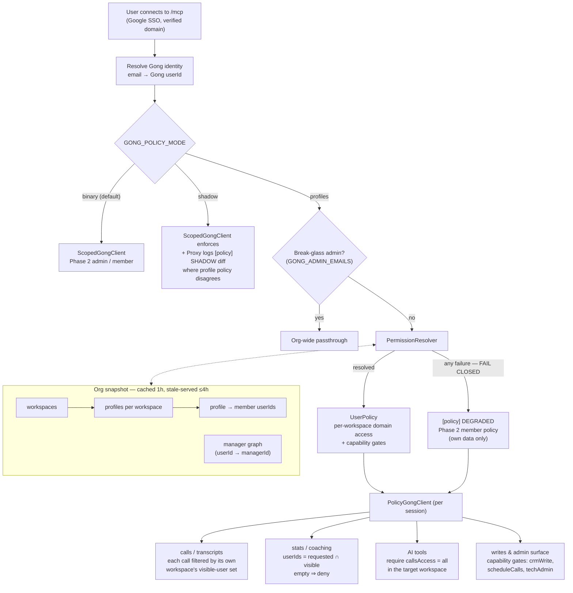

# Phase 3 — Mirror Gong's Native Permission Profiles

**Goal:** each gateway user gets the same data access through the MCP that they have in
the Gong UI — driven by their actual Gong permission profile, not the current binary
admin/member model.

**Status:** 3a–3c implemented (`permissionResolver.ts`, `policyClient.ts`, `policyShadow.ts`,
`GONG_POLICY_MODE` switch — see [phase3a-discovery.md](phase3a-discovery.md) for live-data
findings) and live-verified: 9 personas covering every populated profile shape pass the
manual smoke test (`npm run smoke:policy`, results on PR #5). Remaining: 3d shadow soak in
prod, 3e flip + UI-vs-MCP A/B (runbook in [remote-gateway.md](remote-gateway.md)).
Phases 1–2 are live at `gong-mcp-5nu8.onrender.com`.

---

## Where we are (Phase 2 recap)

Today `src/gong/scopedClient.ts` enforces a binary model:

- **admin** (`GONG_ADMIN_EMAILS`) → org-wide passthrough
- **member** → participant-checked calls, self-scoped stats, admin-only writes

This is safe but coarse: a Delivery Manager who can see all Delivery calls in the Gong
UI only sees their own calls through the MCP.

## What we verified against the live API (2026-06-11)

Fetched through the deployed gateway (`gong_list_permission_profiles` on the Customers
workspace, org credential): **the permission profile API gives us everything needed to
mirror UI access.** Real schema, per profile:

```jsonc
{
  "id": "2640638129534878558",
  "name": "Delivery Team Member",
  "callsAccess":   { "permissionLevel": "managers-team", "teamLeadIds": ["2935…", "8319…"] },
  "dealsAccess":   { "permissionLevel": "report-to-them", "teamLeadIds": null },
  "coachingAccess":{ "permissionLevel": "report-to-them", "teamLeadIds": null },
  "insightsAccess":{ "permissionLevel": "report-to-them", "teamLeadIds": null },
  "usageAccess":   { "permissionLevel": "none", "teamLeadIds": null },
  "emailsAccess":  { "permissionLevel": "report-to-them", "teamLeadIds": null },
  "libraryFolderAccess": { "permissionLevel": "all", "libraryFolderIds": null, "manageFolderCalls": true, … },
  "forecastPermissions": { … },
  // ~50 capability booleans:
  "downloadCallMedia": true, "privateCalls": true, "deleteCalls": false,
  "manageScorecards": false, "crmDataImport": false, "aiBuilder": true, …
}
```

**Access levels observed:** `all` | `managers-team` (+ `teamLeadIds`) |
`report-to-them` (+ optional `teamLeadIds`) | `none`.

**GoNimbly's 10 live profiles:** Business Admin, Collaborator, Delivery Manager+,
Delivery Team Member, Executive, Gong Team Admins, Gong Team Member, Integration User,
Restricted, TEST.

Supporting APIs already wrapped in `src/gong/client.ts`:

- `listAllPermissionProfiles(workspaceId)` / `getPermissionProfile(profileId)`
- `getPermissionProfileUsers(profileId)` → user→profile reverse mapping
- `getExtensiveUsers()` → `managerId` for the reporting-tree expansion
- `listWorkspaces()` → profiles are **per workspace** (Customers + People Ops here)

---

## Architecture



### 1. `src/gong/permissionResolver.ts` (new)

Builds and caches, org-wide:

- **profile map**: for each workspace → for each profile → member userIds
  (`listAllPermissionProfiles` + `getPermissionProfileUsers` per profile; ~10 profiles
  × 2 workspaces = ~20 calls, cached 1h)
- **manager graph**: `getExtensiveUsers` → `userId → managerId`; provides
  `reportsOf(leadIds, { transitive: true })`

Resolves per user into a `UserPolicy`:

```ts
interface DomainAccess {
  level: "all" | "managers-team" | "report-to-them" | "none";
  visibleUserIds: Set<string> | null;   // null = unrestricted ("all")
}

interface UserPolicy {
  workspaceIds: string[];               // workspaces where the user has a profile
  calls: DomainAccess;                  // from callsAccess (+ self, always)
  deals: DomainAccess;                  // from dealsAccess
  coaching: DomainAccess;               // from coachingAccess
  stats: DomainAccess;                  // from insightsAccess/usageAccess (see mapping)
  library: { level: "all" | "selected" | "none"; folderIds: Set<string> | null };
  capabilities: {                       // straight from the booleans
    downloadCallMedia: boolean;
    privateCalls: boolean;
    manageScorecards: boolean;
    crmWrite: boolean;                  // crmDataImport || crmDataInlineEditing
    aiTools: boolean;                   // see mapping table
    techAdmin: boolean;                 // manageGeneralBusinessSettings
  };
}
```

Visible-set computation:

- `all` → `null` (no filter)
- `managers-team` → expand each `teamLeadIds` entry to lead + **transitive** reports, union
- `report-to-them` → with `teamLeadIds`: transitive reports of those leads; with `null`:
  transitive reports of **the user themself** (verify in 3a — see open questions)
- `none` → empty set
- Always add the user's own userId for calls (UI always shows your own calls)

**Fail closed:** any resolver error (profile API down, user in no profile) degrades the
session to the current Phase 2 member policy (own calls only) and logs
`[policy] DEGRADED …`. Never fail open.

### 2. `src/gong/policyClient.ts` (new, replaces role checks in `ScopedGongClient`)

Same subclass-of-`GongClient` pattern, but driven by `UserPolicy` instead of the binary
role:

- **Calls** (list/get/extensive/transcripts): filter by
  `party.userId ∈ calls.visibleUserIds` (or unrestricted when `null`); `none` → tool
  returns a clear denial. Workspace queries restricted to `policy.workspaceIds`.
- **Stats/coaching**: instead of forcing `userIds = [self]`, force
  `userIds = requested ∩ visibleUserIds` (default: the full visible set). A manager
  asking for their team's talk ratios now gets them — exactly like the UI.
- **Library**: gate on `library.level`; restrict folder content to `folderIds` when set.
- **CRM/deals reads**: gate on `deals.level ≠ none`; writes on `capabilities.crmWrite`.
- **AI tools** (`ask_account`, `ask_deal`, `generate_brief`): require
  `calls.level === "all"` (they synthesize from org-wide calls — anything less leaks).
- **Admin tools** (permission profiles, data privacy, audit logs, integrations):
  `capabilities.techAdmin`.
- `GONG_ADMIN_EMAILS` remains as a break-glass override on top of profiles.

### 3. Rollout switch

`GONG_POLICY_MODE` env var:

- `binary` (current behavior, default initially)
- `shadow` — enforce binary, but compute profile policy too and log every place the
  decisions differ (`[policy] SHADOW diff …`). Zero user impact; validates the resolver
  against production traffic.
- `profiles` — enforce profile-based policy (target default)

---

## Profile → tool mapping

| Profile field | Gateway behavior |
|---|---|
| `callsAccess` | visibility filter for `gong_list_calls`, `gong_get_call`, `gong_get_extensive_calls`, `gong_get_transcripts` |
| `insightsAccess` / `usageAccess` | scope for stats tools (interaction, activity, scorecard stats) |
| `coachingAccess` | scope for `gong_get_coaching` |
| `dealsAccess` | gate + scope for CRM/deal reads, `gong_get_crm_entities` |
| `libraryFolderAccess` | gate for library tools; folder restriction when `libraryFolderIds` set |
| `manageGeneralBusinessSettings` | admin tools: permission profiles, integration settings, audit logs, data privacy |
| `crmDataImport` / `crmDataInlineEditing` | CRM writes |
| `manageScorecards` | scorecard/tracker writes (currently none exposed — future) |
| `manuallyScheduleAndUploadCalls` | `gong_create_call`, meetings create/update/delete |
| `callsAccess.level === "all"` | AI tools (`ask_account`, `ask_deal`, `generate_brief`) |
| `emailsAccess`, `forecastPermissions` | no MCP tools today — ignore until tools exist |

---

## Open questions for 3a (discovery)

1. **`report-to-them` with `teamLeadIds: null`** — confirm it means "reports of the
   authorizing user" (Collaborator profile has explicit leads; Delivery Team Member's
   `dealsAccess` has null). Verify by comparing a real user's UI against the API.
2. **Transitive vs direct reports** for `managers-team` — compare a second-level
   report's UI visibility.
3. **Private calls** — extensive call metadata exposes privacy flags? If a call is
   private in the UI, confirm whether the org credential even returns it, and filter
   using `capabilities.privateCalls`.
4. **Per-workspace profile conflicts** — a user with different profiles in Customers vs
   People Ops: queries without a workspaceId must apply per-workspace filtering, not
   the max of both.
5. **Users in no profile** (e.g. new hires) — confirm fail-closed degradation path.
6. **"Integration User" profile oddity** — `callsAccess.level: "none"` but ~34
   `teamLeadIds`. Understand what the UI does with that combination.
7. Profile churn — is 1h cache TTL acceptable to RevOps? (Profile edits take ≤1h+token
   refresh to propagate.)

## Phasing & estimates

| Phase | Work | Est |
|---|---|---|
| **3a Discovery** | Answer open questions against real users; dump 3 personas' profiles + manager graph into `src/gong/__fixtures__/`; document `report-to-them` semantics | 1 day |
| **3b Resolver** | `permissionResolver.ts` + cache + fail-closed degradation; unit tests on fixtures | 2 days |
| **3c Policy client** | `policyClient.ts`, port the 16 admin-only gates to capability gates, stats intersection scoping; unit tests (extend the existing 53-test suite) | 2–3 days |
| **3d Shadow mode** | `GONG_POLICY_MODE=shadow` in prod ~1 week; review `SHADOW diff` logs; fix mismatches | 0.5 day + soak |
| **3e Flip + validate** | Default `profiles`; UI-vs-MCP comparison with 3 personas (Executive, Delivery Manager+, Collaborator — e.g. Caio); update docs | 1 day |

## Verification

- **Unit**: fixtures from 3a drive resolver + policy tests (no live API in CI).
- **Shadow logs**: zero unexplained diffs across a week of real usage before the flip.
- **Live A/B per persona**: for each of the 3 personas, pick 5 calls visible in their UI
  and 5 that aren't; confirm the MCP matches 10/10. Same for a stats query on a
  teammate.
- **Regression**: the Phase 2 suite keeps passing in `binary` mode.

## Risks

- **Fidelity gaps**: per-call explicit shares and email permissions aren't fully
  introspectable via the API — document as known deltas rather than chasing 100%.
- **Resolver blast radius**: a bug here is a data-exposure bug. Shadow mode and
  fail-closed degradation are the mitigations; both are non-negotiable.
- **API cost**: ~20 cached calls/hour org-wide + 1 user-graph call — negligible.
